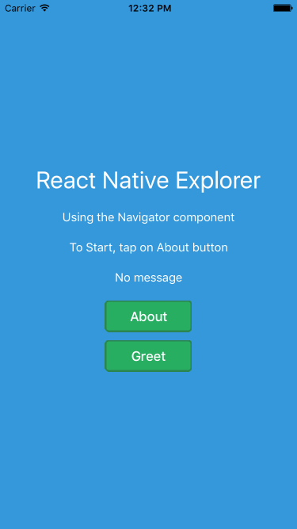
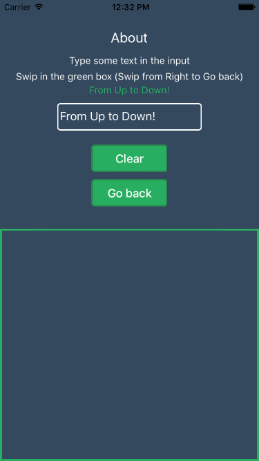

# Explorer

Basic navigation Explorer app in React Native and ES6 syntax

## Platform

- iPhone 6
- iOS 9.2

## How to run

1. Run `npm install`
2. Open ios/Explorer.xcodeproj in Xcode and hit run

## Screenshots

