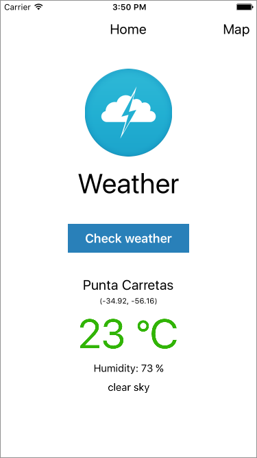
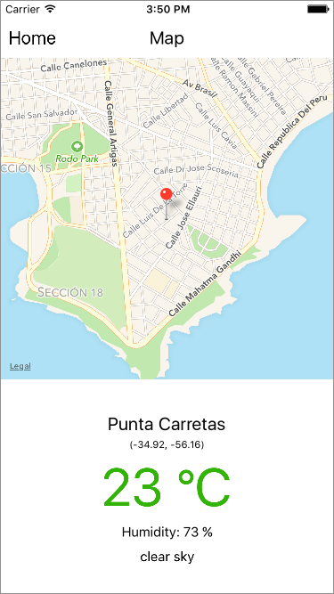
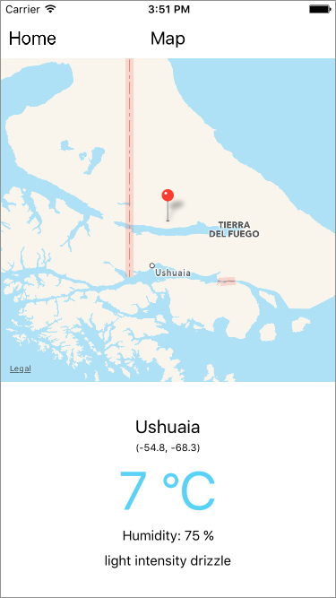
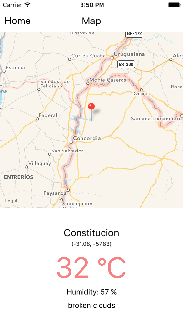

# Weather

Weather app in React Native and ES6 syntax, based on course [https://www.udemy.com/reactnative/](https://www.udemy.com/reactnative/)

## Platform

- iPhone 6
- iOS 9.2

## How to run

```
npm install
react-native run-ios
```

## Screenshots








